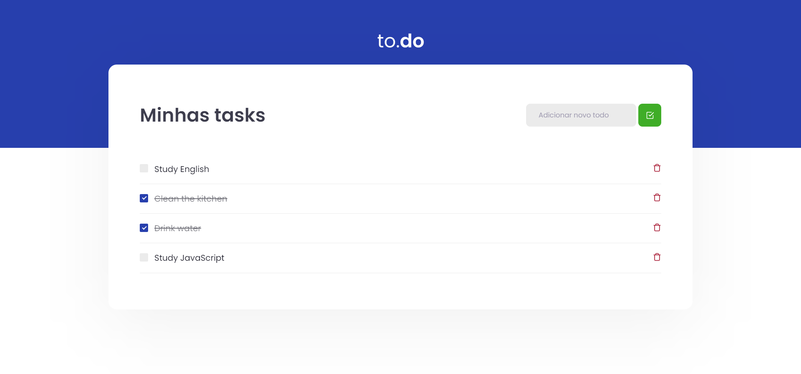

# 🚀 Journey Ignite Rocketseat -> Challenge01 - React Concepts

This challenge is intended to train the concepts of state manipulation in React by creating a simple task list application.
In solving this challenge it was possible to:
- Add a new task;
- Remove a task;
- Mark and unmark a task as completed. 

